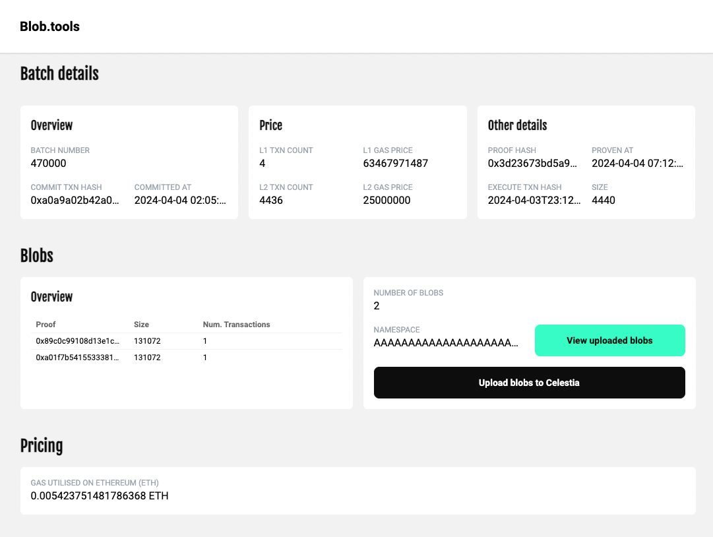
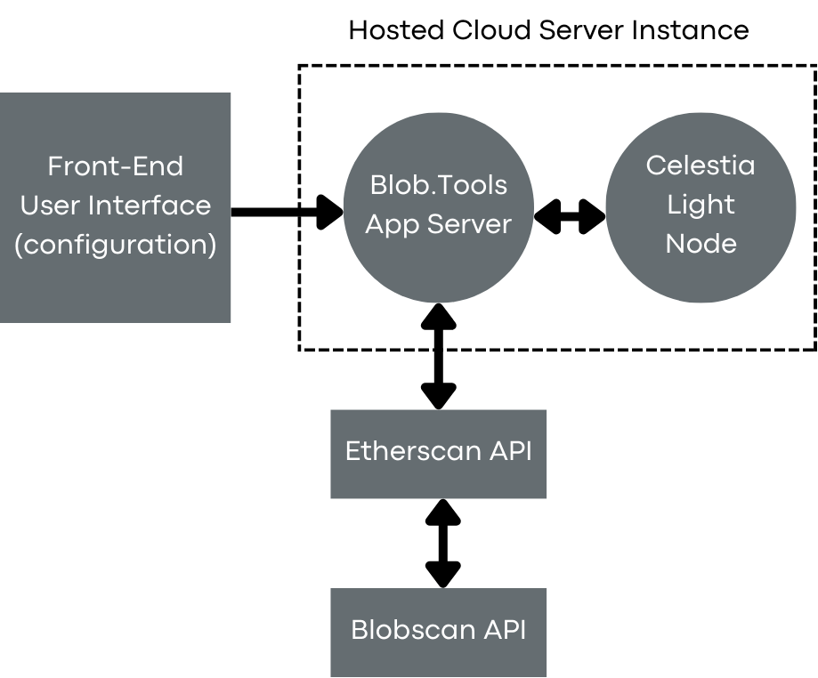

# Blob.Tools

Blob.Tools is a frictionless UI/UX application to demonstrate blob migration paths to  Celestia and perform initial backup syncs with their original Data availability solution (In this case EIP-4844 targetting ZKSync Era's Blobs).

- No need for faucets
- Direct blob migration queries
- Estimate actual savings if truly migrated (code refactoring)

## Demo

Product demo can be found at Blob.tools
(A sample blob migration for [ZKsync Era's](https://explorer.zksync.io/) Batch #470,000 is at https://blobtools.fly.dev/?b=470000)

## Installation

Install dependencies for the application server:
- Git CLI
- Docker Desktop
- Devbox Shell

Installation details (In terminal)
- Enter `make`
- Enter `make launch`

For Celestia Node,
- Refer to installation and node operation details at [Celestia's documentation](https://docs.celestia.org/developers/node-tutorial#setting-up-dependencies)

## Architecture
Blob.tools operates using a low cost implementation single server with a integrated light node in-built as demonstration (may explore decentralization approaches in future).

## Authors

* **Joel Tong** - *POC & Development* - [Joel Tong](https://github.com/myrtletree33)

* **Joshua Cheong** - *Ideation & Architecture work* - [Joshua Cheong](https://github.com/joshuacheong)

## License

This project is licensed under the MIT License - see the [LICENSE.md](LICENSE.md) file for details.

